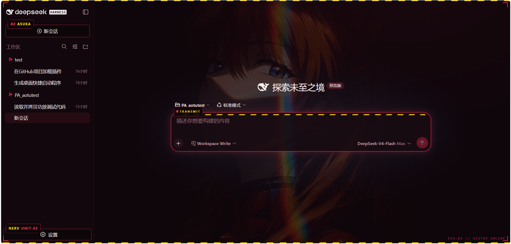

# dsh-eva-skin

DeepSeek Harness Web GUI 的 EVA 皮肤——明日香(EVA-02)红黑主题、壁纸、侧栏机械装饰、输入框特效,以及 Codex 风格的产物 Diff 查看器。

[English](README.md)

## 预览



## 功能

- **EVA 红黑主题** — 通过主题注册表 `overrideTokens` 叠加 token 层(以 inline 变量写入 body,优先级高于所有样式表):半透明深红表面、EVA 红 `#ff3355` 强调、暖白文字、红色边框、琥珀警示、EVA 绿成功态。插件会把配色锁定为深色模式(经典红黑,不会发粉);卸载插件即可恢复之前的主题选择。
- **明日香壁纸** — 全视口背景图(以 data URI 内嵌进 bundle,无需静态路由)+ 两团红色光晕。
- **侧栏机械装饰** — 点击穿透的固定装饰层(z-index 15):上下黄黑警示条、四角红色角标、右下 `EVA-02 // SYSTEM ONLINE` 等宽状态字。侧栏「新会话」和「设置」按钮配 EVA 红框深底(内容居中),紧凑的 `02 ASUKA` / `NERV UNIT-02` 标签挂在各自按钮框左上角的正上方,不遮挡按钮文字。工作区树里的文件夹图标替换为红色 EVA 风蝴蝶(倾斜 30°);品牌字标里的 HARNESS 徽章文字也做了反色修正,保证可读。
- **输入框特效** — 发消息的输入框:红色描边 + 聚焦红光、顶部黄黑警示条、上沿 `TRANSMIT` 铭牌。
- **产物 Diff 查看器** — 类似 Codex:每次修改后,点击聊天末尾的产物文件芯片,右侧弹出 EVA 风格面板,展示该文件的当前完整内容——所有行用白色等宽字体呈现,只有被删除的行标红、新增的行标绿(diff 数据取自会话,按路径匹配任意轮次);全文内容经配套的 `eva-files` 服务插件(回环路由,从磁盘读取文件)获取,读取失败时回退为 hunk 拼接视图或读取失败提示。产物一多、一行放不下时会出现 "+N" 余数,点击它弹出该轮全部产物文件名列表,再点名字即可打开对应文件。✕ 旁有「固定」开关:固定后点击面板外部不会关闭,且遮罩会变透明、不再拦截点击——主窗口恢复亮度,左侧聊天可以正常点击和输入,弹窗悬浮在右侧(✕ 与 Esc 始终可关)。面板打开期间中间的聊天列会让出右侧空间(内容被往左挤,不被遮挡),关闭后恢复。按 ✕、Esc 或点击面板外部任意区域关闭。

## 环境要求

- 一份 `deepseek-harness` 检出,并运行着 `dsh web` GUI(皮肤通过 web profile 的用户 patch 层挂载)。
- 插件的构建产物已随仓库附带在 `lib/` —— 直接使用无需构建。

## 安装

### Windows

```powershell
powershell -ExecutionPolicy Bypass -File install.ps1
```

### macOS / Linux

```bash
./install.sh
```

脚本会把本目录链接到 `$DSH_HOME/profiles/node_modules/@deepseek-ai/dsh-client-ui-eva`、把配套文件服务链接到 `@deepseek-ai/dsh-eva-files`(profile 模块回退目录),并在 `$DSH_HOME/profiles/<profile>/cordis.patch.yml` 注册 `ui-eva` 与 `eva-files` 两行(默认 profile:`web`,可通过第一个参数指定)。然后**刷新 GUI 页面(F5)**。

> 运行中的服务器会热挂载用户 patch 层的新行;如果皮肤没出现,重启 `dsh web` 再刷新。`eva-files` 配套插件通过回环路由把产物文件的当前内容提供给 diff 面板;要看到全文视图必须保留它。

### 手动安装(任意平台)

1. 把本包复制到 harness 检出的 `packages/client/ui-eva`。
2. 注册三处(参见 harness 的 `packages/client/AGENTS.md`):`tsconfig.client.json` 引用、`packages/bundle/web-app/package.json` 依赖、web profile 的 `cordis.patch.yml` 行:

   ```yaml
   - insert:
       - id: ui-eva
         name: '@deepseek-ai/dsh-client-ui-eva'
       - id: eva-files
         name: '@deepseek-ai/dsh-eva-files'
   ```

3. 构建 bundle:`pnpm --filter @deepseek-ai/dsh-client-ui-eva run bundle`(需要 harness 工具链,见下)。

## 使用

- **应用皮肤** — 刷新 GUI 页面(F5 / Ctrl+F5)。安装与更新都会经由运行中服务器的 patch 热挂载生效;若没变化,重启 `dsh web`。
- **查看改动** — agent 修改或创建文件后,该轮末尾会出现产物文件芯片;点击任意一个,右侧弹出 diff 面板,展示该文件当前的完整内容:所有行白色、只有被改动的行标红(删除)/标绿(新增),内容经 `eva-files` 配套路由读取、diff 数据取自会话;文件无法读取(已删除、二进制、过大)时回退为改动区域视图或读取失败提示。产物行放不下时出现 "+N" 余数,点击弹出该轮全部产物文件列表,再点名字打开对应文件。默认点击面板外部关闭;点 ✕ 旁的「固定」后点击外部不再关闭,且遮罩变透明、事件穿透——主窗口亮度恢复,左侧聊天可正常点击和输入,弹窗悬浮在右侧(✕ 与 Esc 始终可关)。面板打开时聊天列被往左挤出让出空间,关闭后恢复原状。按 ✕、Esc 或点击面板外部任意区域关闭。
- **其他皮肤** — 本插件激活期间按"一次一个皮肤"处理;禁用或删除 `ui-eva` 行即可恢复之前的主题偏好与其他皮肤的装饰。

## 工程结构

```
dsh-eva-skin/
├── src/                          # 皮肤包(@deepseek-ai/dsh-client-ui-eva)
│   ├── index.ts                  #   node 半:apply 为空(loader 需要一个可解析入口
│   │                             #     才能扫描 dsh.client 声明)
│   ├── invariant.ts              #   harness invariant 约定(空安装器)
│   └── client/                   #   浏览器半,打包为 lib/client.js
│       ├── index.ts              #     入口:锁定深色、token 覆写、注入样式、
│       │                         #     挂载装饰、锚定角标、产物面板接线
│       ├── eva-theme.ts          #     token 覆写(红黑配色)
│       ├── eva.css.ts            #     全部样式:壁纸、装饰、面板、输入框
│       ├── eva-chrome.ts         #     装饰层 + 侧栏角标结构
│       ├── asuka.data.ts         #     壁纸 data URI(scripts/embed-image.mjs 生成)
│       ├── eva-artifacts.ts      #     diff 收集器 + 会话快照 diff 查找
│       └── eva-artifacts-panel.tsx  # 产物面板与 "+N" 溢出列表
├── files/                        # 服务端配套(@deepseek-ai/dsh-eva-files,仅 node)
│   ├── src/index.ts              #   /eva-files/content 回环路由(从磁盘读文件文本)
│   └── lib/index.js              #   配套插件构建产物
├── lib/                          # 已入库的构建产物——使用皮肤无需构建
│   ├── client.js (+ .map)        #   浏览器 bundle
│   ├── index.js                  #   node 半
│   └── invariant.js              #   invariant 配套
├── assets/
│   ├── asuka.jpg                 #   壁纸源图(同人图)
│   └── preview.png               #   README 预览截图
├── scripts/embed-image.mjs       # 壁纸 → data URI 嵌入脚本(`pnpm run embed`)
├── install.ps1 / install.sh      # 两个包的链接 + patch 行安装脚本
├── tsdown.config.ts              # 构建配置(harness 的 tsdown.client.ts 预设)
└── tsconfig.json
```

## 自定义

- **壁纸** — 替换 `assets/asuka.jpg`,然后 `pnpm run embed`(重新生成 `src/client/asuka.data.ts`)并重新构建。
- **配色** — `src/client/eva-theme.ts`(DARK 与 LIGHT 两套,按 token 分组)。
- **角标标签** — 位置与大小在 `src/client/eva.css.ts`(`.eva-asuka[data-eva-anchor]`、`.eva-nameplate[data-eva-anchor]`,两者都挂在 `top:-16px; left:6px`);结构在 `src/client/eva-chrome.ts`。
- **侧栏按钮框** — 新会话/设置按钮的红框样式在 `eva.css.ts`(`button[class*='newSession']` 与 `[data-slot='sidebar.settings'] > button` 规则)。
- **文件夹蝴蝶** — `eva.css.ts` 里 `span[class*='folder']:has(svg)` 规则的 data URI SVG(旋转是组上的 `rotate(30)` 变换)。
- **Diff 面板** — 组件 `src/client/eva-artifacts-panel.tsx`;样式在 `eva.css.ts` 的 `#dsh-eva-artifacts` 区块;只读的 diff 收集器在 `src/client/eva-artifacts.ts`;全文内容路由在配套包 `files/`(`files/src/index.ts`)。
- **其他装饰** — 结构在 `src/client/eva-chrome.ts`;样式在 `src/client/eva.css.ts` 的 `#dsh-eva-chrome` 与输入框区块。

## 从源码构建

bundle 使用 harness 的共享 `tsdown.client.ts` 预设构建,因此独立仓库里构建需要一份 `deepseek-harness` 检出:把包放到 `packages/client/ui-eva`,然后在仓库根执行

```sh
pnpm install
pnpm --filter @deepseek-ai/dsh-client-ui-eva run bundle
```

node 半(`lib/index.js`、`lib/invariant.js`)与浏览器 bundle(`lib/client.js`)都直接从 `src/` 编译,无需单独的 `tsc` 步骤。`files/` 配套插件用同样的方式从自己的目录构建(普通 `tsdown` 配置)。

## 卸载

删除 `$DSH_HOME/profiles/*/cordis.patch.yml` 中的 `ui-eva` 与 `eva-files` 行,以及 `profiles/node_modules/@deepseek-ai/dsh-client-ui-eva` 和 `profiles/node_modules/@deepseek-ai/dsh-eva-files` 两个链接,然后刷新 GUI(或重启 `dsh web`)。

## 说明

- `assets/asuka.jpg` 是《新世纪福音战士》角色明日香的同人图;发布或再分发本皮肤时请注意图片来源与版权。
- 皮肤只影响展示:不渲染工具、不注册命令、不产生会话事件——GUI 的模型可见面不受影响。Diff 查看器只读取会话日志里已应用的改动,外加(经 `eva-files` 配套插件)从磁盘读取产物文件的当前内容;该路由只在 Web 服务器的绑定地址上响应(默认回环地址),并拒绝目录、二进制文件和超过 2 MiB 的文件。

## License

MIT
